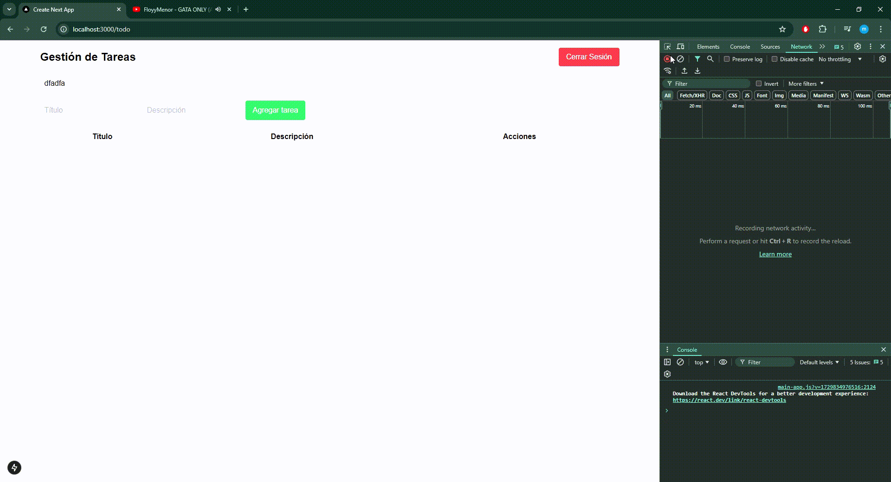

# Gestión de Tareas - Next.js

Este proyecto es una aplicación de gestión de tareas desarrollada en **Next.js**. La aplicación permite a los usuarios buscar, agregar, editar y eliminar tareas de manera intuitiva y eficiente.



## Características

- **Búsqueda en tiempo real**: Filtra las tareas por título con una búsqueda reactiva.
- **Gestión completa de tareas**: Crea, edita y elimina tareas fácilmente.
- **Autenticación de usuario**: La aplicación redirige a los usuarios no autenticados a la página de inicio de sesión.
- **Paginación de tareas**: Navega por las tareas con controles de paginación para facilitar la organización.

## Tecnologías Utilizadas

- **Next.js**: Framework de React para aplicaciones web.
- **Axios**: Para realizar solicitudes HTTP a la API de tareas.
- **CSS**: Estilos personalizados para una interfaz atractiva y sencilla.
- **TypeScript** (Opcional): Para una mejor tipificación en el desarrollo.

## Instalación y Ejecución

1. **Clonar el repositorio**:

   ```bash
   git clone https://github.com/tu-usuario/tu-repositorio.git
   cd tu-repositorio
   ```

2. **Instalar dependencias**:

   ```bash
   npm install
   ```

3. **Ejecutar el servidor de desarrollo**:

   ```bash
   npm run dev
   ```

4. **Abrir la aplicación en tu navegador**:
   - Visita [http://localhost:3000](http://localhost:3000) para ver la aplicación en funcionamiento.

## Estructura del Proyecto

- **pages/**: Contiene las páginas principales de la aplicación, incluidas las de autenticación y gestión de tareas.

- **components/**: Componentes reutilizables de la interfaz, organizados siguiendo el enfoque de **Atomic Design**:

  - **atoms/**: Elementos básicos e independientes como botones, campos de entrada, etc.
  - **molecules/**: Combinaciones de átomos que forman estructuras pequeñas, como controles de paginación.
  - **organisms/**: Componentes más complejos que combinan moléculas y átomos, como listas de tareas y formularios completos.

- **core/services/**: Servicios para la interacción con la API de tareas, manejando las solicitudes HTTP y la comunicación con el backend.

- **core/middlewares/**: Middlewares para la autenticación de usuarios, utilizando **hooks de React** para verificar y gestionar el estado de autenticación en cada página.
